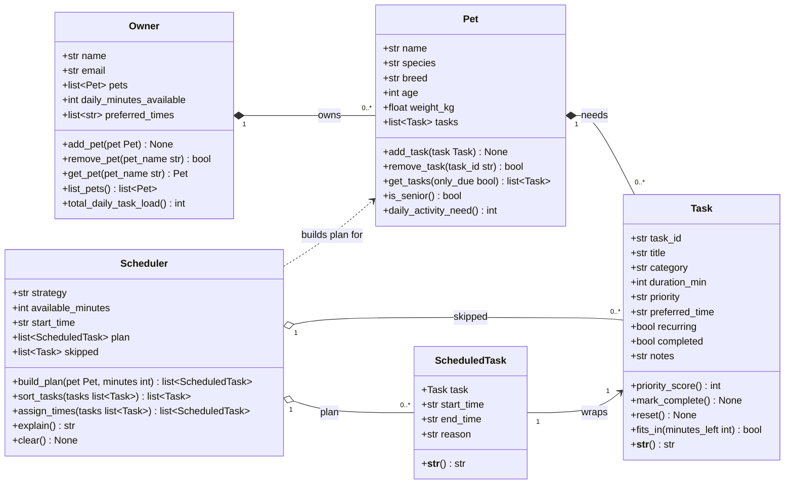
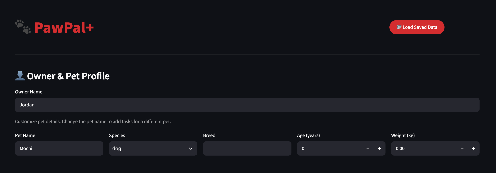
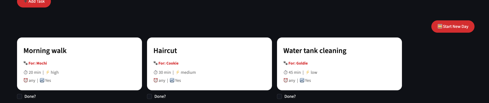
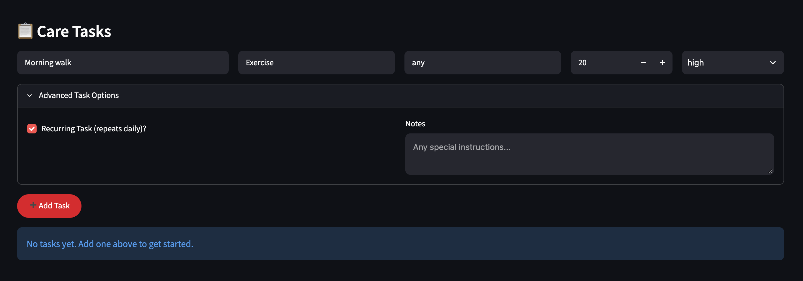
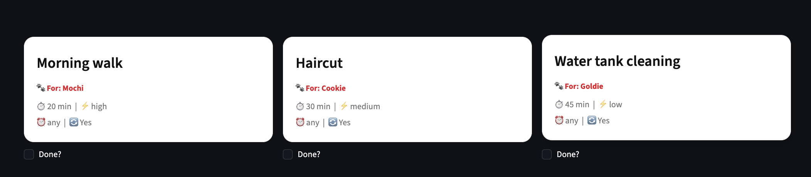
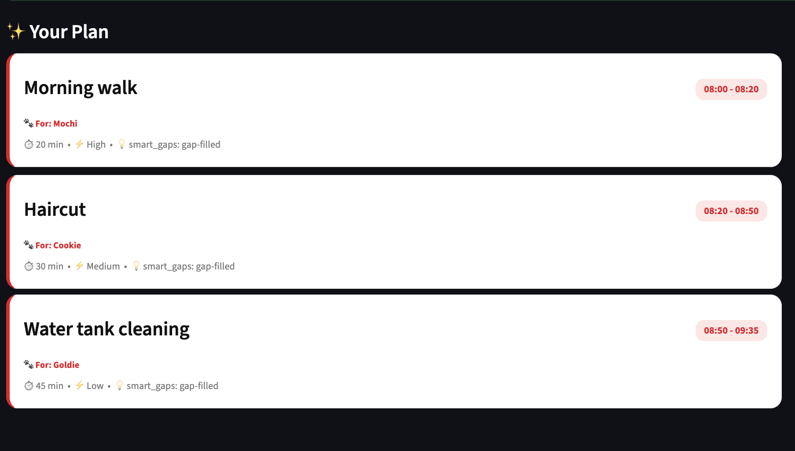
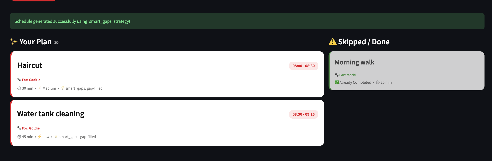
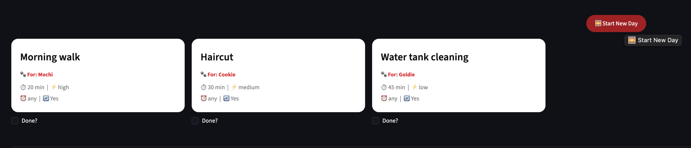

# PawPal+ (Module 2 Project)

You are building **PawPal+**, a Streamlit app that helps a pet owner plan care tasks for their pet.

## Scenario

A busy pet owner needs help staying consistent with pet care. They want an assistant that can:

- Track pet care tasks (walks, feeding, meds, enrichment, grooming, etc.)
- Consider constraints (time available, priority, owner preferences)
- Produce a daily plan and explain why it chose that plan

Your job is to design the system first (UML), then implement the logic in Python, then connect it to the Streamlit UI.

## What you will build

Your final app should:

- Let a user enter basic owner + pet info
- Let a user add/edit tasks (duration + priority at minimum)
- Generate a daily schedule/plan based on constraints and priorities
- Display the plan clearly (and ideally explain the reasoning)
- Include tests for the most important scheduling behaviors

## Getting started

### Setup

```bash
python -m venv .venv
source .venv/bin/activate  # Windows: .venv\Scripts\activate
pip install -r requirements.txt
```

### Suggested workflow

1. Read the scenario carefully and identify requirements and edge cases.
2. Draft a UML diagram (classes, attributes, methods, relationships).
3. Convert UML into Python class stubs (no logic yet).
4. Implement scheduling logic in small increments.
5. Add tests to verify key behaviors.
6. Connect your logic to the Streamlit UI in `app.py`.
7. Refine UML so it matches what you actually built.

## 🧩 System Design (UML)

Source: [`diagrams/uml.mmd`](diagrams/uml.mmd) (Mermaid). The classes match `pawpal_system.py`.

- **Owner**: the person, their available minutes per day, and their preferred times. Owns 0..* `Pet`s.
- **Pet**: basic pet info. Owns 0..* `Task`s.
- **Task**: one care item (duration, priority, preferred time, recurring/completed).
- **Scheduler**: sorts a pet's tasks by strategy, fits them into the time budget, and lays them out as `ScheduledTask`s. Tasks that don't fit go into `skipped`, and `explain()` describes why.
- **ScheduledTask** (helper): a `Task` with a start time, end time, and reason.



## 🖥️ Sample Output

Paste a sample of your app's CLI or Streamlit output here so a reader can see what a generated plan looks like:

```
🐾 Welcome to PawPal+ CLI Demo 🐾

Created Owner: Alex with 60 mins available today.
Added Pets: Biscuit (Dog) and Mochi (Cat)

Tasks added across all pets:
- Biscuit's tasks:
    - Morning walk (30m, priority: high, time: 08:00)
    - Feed Breakfast (10m, priority: high, time: 08:30)
    - Playtime (20m, priority: medium, time: any)
- Mochi's tasks:
    - Brush fur (15m, priority: low, time: 09:00)
    - Give medication (5m, priority: high, time: 08:25)

Initializing Scheduler...

--- Generating Schedule (Executing Algorithms) ---
Plan Explanation (Strategy: priority)
WARNING - Scheduling Conflicts Detected:
 ! Conflict: 'Morning walk' overlaps with 'Give medication'
Scheduled tasks: 4
 - 08:00-08:30  Morning walk (strategy: priority)
 - 08:25-08:30  Give medication (strategy: priority)
 - 08:30-08:40  Feed Breakfast (strategy: priority)
 - 09:00-09:15  Brush fur (strategy: priority)
Skipped tasks: 1
Skipped due to time constraints:
 - Playtime (20 min)
```

## 🧪 Testing PawPal+

```bash
# Run the full test suite:
pytest

# Run with coverage:
pytest --cov
```

Sample test output:
#output 1

```
# (.venv) prithvikarki@Prithvis-MacBook-Air ai110-module2show-pawpal-starter % pytest
======================================================================================== test session starts ========================================================================================
platform darwin -- Python 3.13.0, pytest-9.1.1, pluggy-1.6.0
rootdir: /Users/prithvikarki/Documents/CS Projects/PawPal/ai110-module2show-pawpal-starter
plugins: anyio-4.15.1
collected 4 items                                                                                                                                                                                   

tests/test_pawpal.py ....                                                                                                                                                                     [100%]

========================================================================================= 4 passed in 0.01s =========================================================================================
```
#Output 2 

```(.venv) prithvikarki@Prithvis-MacBook-Air ai110-module2show-pawpal-starter % pytest --cov          
====================================================== test session starts ======================================================
platform darwin -- Python 3.13.0, pytest-9.1.1, pluggy-1.6.0
rootdir: /Users/prithvikarki/Documents/CS Projects/PawPal/ai110-module2show-pawpal-starter
plugins: cov-7.1.0, anyio-4.15.1
collected 4 items                                                                                                               

tests/test_pawpal.py ....                                                                                                 [100%]

======================================================== tests coverage =========================================================
_______________________________________ coverage: platform darwin, python 3.13.0-final-0 ________________________________________

Name                   Stmts   Miss  Cover
------------------------------------------
pawpal_system.py         256    132    48%
test_bug.py                9      0   100%
tests/test_pawpal.py      37      0   100%
------------------------------------------
TOTAL                    302    132    56%
======================================================= 4 passed in 0.05s =======================================================
```

## 📐 Smarter Scheduling

> Fill in once you've implemented scheduling logic.

| Feature | Method(s) | Notes |
|---------|-----------|-------|
| Task sorting | | e.g., by priority, duration |
| Filtering | | e.g., skip tasks if time runs out |
| Conflict handling | detect_conflicts() | e.g., overlapping time slots |
| Recurring tasks | handle_recurring_tasks() | e.g., daily vs. weekly |

## 💾 Data Persistence Workflow

The system provides robust JSON save/load functionality so that pets and tasks seamlessly persist between application runs. This is driven by the `Storage` class.

**Persistence Workflow:**
1. **Saving:** The `Storage.save_owner(owner, filename)` method kicks off a recursive `to_dict()` chain. The `Owner` extracts basic data and iterates through its `Pet`s, which in turn iterate through their `Task`s, building a fully serialized JSON string and saving it to `pawpal_data.json`.
2. **Loading:** `Storage.load_owner(filename)` reverses the process. It pulls the JSON blob, passing it to `Owner.from_dict()`, which constructs Python class objects recursively down to individual `Task` objects, perfectly restoring the state of the application.

**Files Modified:**
- `pawpal_system.py`: Implemented `to_dict` and `from_dict` inside `Task`, `Pet`, and `Owner`. Created a new `Storage` class with static save/load methods to handle the file operations.

## ✨ Professional UI & Output Formatting

The CLI output of PawPal+ has been significantly enhanced to provide a beautiful, structured reading experience.
- **Libraries Used:** Integrated the `tabulate` library (added to `requirements.txt`) to dynamically render grid-style ASCII tables for both the scheduled tasks and the skipped tasks.
- **Formatting Features:** The `Scheduler.explain()` method now injects **ANSI color codes** (Cyan, Green, Yellow, Red) to visually highlight headers, success states, and critical scheduling warnings. It also heavily utilizes **emoji iconography** (📅, 🐾, ⏰, ⚠️, ✅, ⏭️) to make visual scanning of the schedule far more intuitive!

## 📸 Demo Walkthrough

Describe your app in numbered steps so a reader can follow along without watching a video:

1. Load or Create a Profile: Start by entering your name and your pet's details (Name, Species, Breed, Age, Weight) in the "Owner & Pet Profile" section. If you've used the app before, you can click the "📂 Load Saved Data" button to instantly restore your previous session.


2. Add Care Tasks: Use the "Care Tasks" form to input daily responsibilities. You can specify the duration, priority, preferred times (e.g., "08:00"), and even toggle "Advanced Task Options" to set it as a "Recurring Task" and add custom "Notes".

3. Manage Multiple Pets: To add tasks for a second pet, simply change the "Pet Name" in the profile section and keep adding tasks. The task grid will automatically update to label tasks with their newly assigned pet (e.g., 🐾 For: Mochi vs 🐾 For: Rex).

4. Configure & Generate Schedule: In the "Build Schedule" section, set your total available minutes for the day, your starting time, and choose a scheduling strategy (like smart_gaps). Click "✨ Generate Schedule" to trigger the backend algorithms.

5. Review the Plan: The app generates a customized layout. Successfully scheduled tasks appear on the left with their calculated time slots highlighted in red badges, while tasks that couldn't fit into your time budget are grouped on the right under the "⚠️ Skipped / Done" column.

6. Complete Tasks & Start New Day: As you finish tasks in real life, check the "Done?" box to instantly grey them out. The next morning, simply click "🌅 Start New Day" to automatically uncheck all your recurring tasks so you can start fresh!



